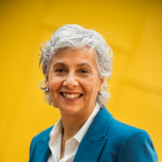
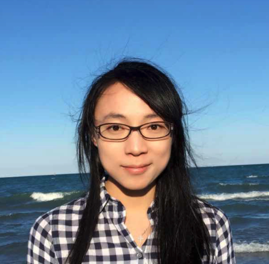
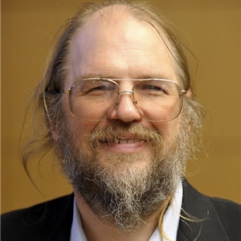
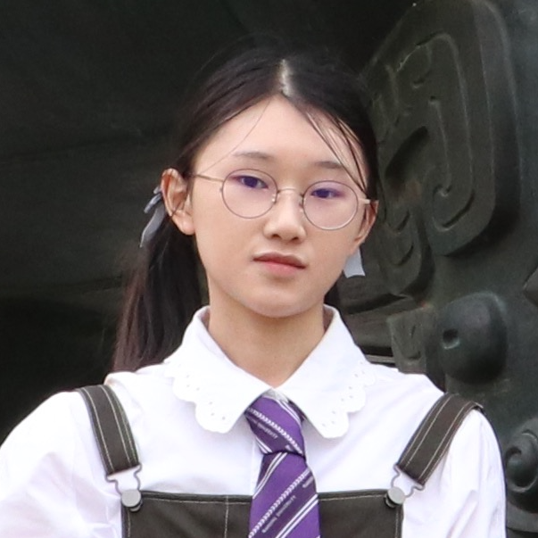

<!-- # CVPR 2021 Workshop on Adversarial Machine Learning in Real-World Computer Vision Systems and Online Challenges (AML-CV) -->

<!-- ## Overview -->
<!-- 
* **Date** : One-day workshop on XX,XXX 2021 
* **Location** : The workshop will be held virtually.  -->

## Overview
As computer vision models are being increasingly deployed in the real world, including applications that require safety considerations such as self-driving vehicles, it is imperative that these models are robust and secure even when subject to adversarial attacks. 

This workshop will focus on recent research and future directions for security problems in real-world machine learning and computer vision systems. We aim to bring together experts from the computer vision, security, and robust learning communities in an attempt to highlight recent work in this area as well as to clarify the foundations of secure machine learning. We seek to come to a consensus on a rigorous framework to formulate adversarial machine learning problems in computer vision, characterize the properties that ensure the security of perceptual models, and evaluate the consequences under various adversarial models. Finally, we hope to chart out important directions for future work and cross-community collaborations, including computer vision, machine learning, security, and multimedia communities.

The workshop consists of invited talks from the experts in this area, research paper submissions, and a large-scale online competition on adversarial attacks and defenses against real-world systems. In particular, the competition includes two tracks, which cover two novel topics as (1) adversarial attacks on defensed models, and (2) adversarial attacks on image retrieval that have not been investigated elsewhere. 

## Call for Papers
### Topics
Topics include but are not limited to:
* Real world attacks against current computer vision models
* Vulnerabilities and potential solutions to adversarial machine learning in real-world applications, e.g., autonomous driving, 3D object recognition, and large-scale image retrieval
* Detection and defense mechanisms against adversarial examples for computer vision systems
* Theoretic understanding of adversarial machine learning and certifiable robustness
* Real world data distribution drift and its implications to model generalization and robustness 
* Repeatable experiments adding to the knowledge about adversarial examples on image, video, audio, point cloud and other data
* Novel challenges and discoveries in adversarial machine learning for computer vision systems 

### Paper Submissions  
* **Paper submission deadline**: 5/10/2021
* **Notification to authors**: 6/1/2021
* **Camera ready deadline**: 6/12/2021

## Competition
### Competition Track I: Adversarial Attacks on ML Defense Models
In recent years, a large number of adversarial defense methods have been proposed to mitigate the threats of adversarial attacks. However, most of them can be broken with more powerful or adaptive attacks, making it very difficult to judge and evaluate the effectiveness of the current defenses and future defenses. Without a thorough and correct robustness evaluation of the defenses, the progress on this field will be limited.

The goal of this competition is to facilitate reliable evaluation of adversarial robustness of the current defense models in computer vision. In this competition, the organizers will collect various defense models on public benchmarks (e.g., CIFAR-10, ImageNet) for robustness evaluations. The competitors need to develop strong attack algorithms to find the worst-case robustness of those models. We aim to motivate novel attack algorithms to evaluate the adversarial robustness more effectively as well as evaluating the robustness of the current defenses reliably. 

We will collect 20~30 defenses models on CIFAR-10 and ImageNet as the targets. The competition will be conducted on an adversarial learning platform – RealSafe (<a href="https://github.com/thu-ml/realsafe" target="_blank">https://github.com/thu-ml/realsafe</a>). 

### Competition Track II: Adversarial Attacks on Image Retrieval 
Visual search or content-based image retrieval (CBIR) has become a popular research topic in recent years due to the increasing prevalence of online photos in search engines and social media. In Alibaba, image retrieval technology has been widely used on e-commerce systems. For example, Pailitao is an application that applies visual image search to e-commerce, allowing users to search items by taking a photo of the target object. 

The goal of this competition is to evaluate the adversarial robustness of image retrieval systems. Different from previous competitions, it is the first time that takes image retrieval as the attack target. The organizers will release a product image dataset from online e-commerce platforms, and provide some defense models for robustness evaluations. The competitors need to develop attacks to degrade the performance of image retrieval models. The commonly used recall@K metric will be used as evaluation criteria.

### Important Dates of Competition
* **Jan 1**, 2021, Publication of competition overview and rules
* **Jan 1 – April 30**, 2021, Competition runs; generation submissions will be publicly available once submitted
* **May 1**, 2021, Deadline for final submission
* **May 15**, 2021, Organizers begin evaluation of submissions
* **June 1**, 2021, Announce results 
* **June 12**, 2021, The top teams are required to submit a report along with the released code. 

## Invited Speakers

    <a href="https://lihi.net.technion.ac.il/">
        

        
Lihi Zelnik The Technion – Israel Institute of Technology/Alibaba Group

    </a>

    

    <a href="https://zicokolter.com/">
        

        
Zico Kolter CMU    

    </a>

    

    <a href="https://www.ccs.neu.edu/home/alina/">
        

        
Alina Oprea Northeastern University    

    </a>

    

    <a href="https://cs.stanford.edu/~pliang/">
        

        
Percy Liang Stanford University    

    </a>

    <a href="https://www.papernot.fr/">
        

        
Nicolas Papernot University of Toronto 

    </a>

    

    <a href="https://safeai-lab.github.io/">
        

        
Ding Zhao CMU

    </a>

    

    <a href="https://people.eecs.berkeley.edu/~trevor/">
        

        
Trevor Darrell UC Berkeley 

    </a>

    

    <a href="https://www.csail.mit.edu/person/una-may-oreilly">
        

        
Una-May O’Reilly MIT 

    </a>

<!-- * [Lihi Zelnik](https://lihi.net.technion.ac.il/) (The Technion – Israel Institute of Technology/Alibaba Group) -->
<!-- Relevance: expertise in computer vision, and has done extensive work on  robust perception. -->
<!-- * [Zico Kolter](https://zicokolter.com/) (Carnegie Mellon University)s -->
<!-- Relevance: expertise in machine learning, and has done extensive work on safe, robust and explainable machine learning. -->
<!-- * [Alina Oprea](https://www.ccs.neu.edu/home/alina/) (Northeastern University) -->
<!-- Relevance: expertise in security, and has done extensive work at the intersection of machine learning and security. -->
<!-- * [Percy Liang](https://cs.stanford.edu/~pliang/) (Stanford University) -->
<!-- Relevance: expertise in machine learning, and has done extensive work on robust machine learning. -->
<!-- * [Nicolas Papernot](https://www.papernot.fr/) (University of Toronto) -->
<!-- Relevance: expertise in security, and has done extensive work at the intersection of machine learning and security.   -->
<!-- * [Ding Zhao](https://safeai-lab.github.io/) (Carnegie Mellon University) -->
<!-- Relevance: expertise in artificial intelligence, robotics and control, and has done extensive work on safe AI and robust control. -->
<!-- * [Trevor Darrell](https://people.eecs.berkeley.edu/~trevor/) (UC Berkeley) -->
<!-- Relevance: expertise in computer vision, and has done extensive work on adversarial attacks against computer vision models, robust perception, and explainability in computer vision. -->
<!-- * [Una-May O’Reilly](https://www.csail.mit.edu/person/una-may-oreilly) (MIT) -->
<!-- Relevance: expertise in artificial intelligence and machine learning, and has done extensive work at the intersection of artificial intelligence and security. -->

## Schedules

| **Time**                                                         | **Event**                             |
| ------------------------------------------------------------ | --------------------------------- |
| 8:40 - 9:00                                                  | Opening Remarks                   |
|                                     |**Session 1: Adversarial Attacks against Machine Learning Models**|
| 9:00 - 9:30                                                  | Invited Talk #1: Lihi Zelnik      |
| 9:30 - 9:45                                                  | Contributed Talk #1               |
| 9:45 - 10:15                                                 | Invited Talk #2: Nicolas Papernot |
| 10:15 - 10:30                                                | Coffee Break                      |
|                                   |**Session 2: Improving Model Robustness against Adversarial Attacks**|
| 10:30 - 11:00                                                | Invited Talk #3: Zico Kolter      |
| 11:00 - 11:15                                                | Contributed Talk #2               |
| 11:15 - 11:45                                                | Invited Talk #4: Percy Liang      |
| 11:45 - 12:00                                                | Poster Spotlights #1              |
| 12:00 - 1:00                                                 | Lunch                             |
|                          |**Session 3: Robust Perception and Control**|
| 1:00 - 1:30                 | Invited Talk #5: Trevor Darrell   |
| 1:30 - 1:45                                           | Contributed Talk #3               |
| 1:45 - 2:15                                                | Invited Talk #6: Ding Zhao        |
| 2:15 - 3:00 | Poster Session/Break              |
|                                    |**Session 4: Understanding the Vulnerabilities of Machine Learning Models**|
| 3:00 - 3:30 | Invited Talk #7: Alina Oprea      |
| 3:30 - 4:00 | Invited Talk #8: Una-May O’Reilly |
|                                              |**Session 5: Adversarial Machine Learning Competition**|
| 4:00-4:45                           | Winners results showoff |
| 4:45-5:00                                   | Awarding session |

## Organizers

    <a href="https://aisecure.github.io/">
        

        
Bo Li UIUC

    </a>

    

    <a href="https://jungyhuk.github.io/">
        

        
Xinyun Chen UC Berkeley

    </a>

    

    <a href="https://people.eecs.berkeley.edu/~dawnsong/">
        

        
Dawn Song UC Berkeley

    </a>

    

    <a href="http://luthuli.cs.uiuc.edu/~daf/">
        

        
David Forsyth UIUC

    </a>

 

    <a href="http://ml.cs.tsinghua.edu.cn/~jun/index.shtml">
        

        
Jun Zhu Tsinghua University    

    </a>

    <a href="https://www.suhangss.me/">
        

        
Hang Su Tsinghua University    

    </a>

    <a href="https://lihi.net.technion.ac.il/">
        

        
Lihi Zelnik The Technion – Israel Institute of Technology/Alibaba Group

    </a>

    <a href="https://scholar.google.com/citations?user=cWbXLzgAAAAJ&hl=zh-CN">
        

        
Yuan He Alibaba Group    

    </a>

    <a href="https://kkkkahlua.github.io/">
        

        
Fan Wu UIUC

    </a>

    <a href="https://alphapav.github.io/">
        

        
Chulin Xie UIUC

    </a>

<!-- 
* Bo Li, UIUC (lbo@illinois.edu) (**Point of contact**)
* Xinyun Chen, UC Berkeley (xinyun.chen@berkeley.edu)
* Dawn Song, UC Berkeley (dawnsong@cs.berkeley.edu)
* David Forsyth, UIUC (daf@illinois.edu)
* Jun Zhu, Tsinghua University (dcszj@tsinghua.edu.cn)
* Hang Su, Tsinghua University (suhangss@tsinghua.edu.cn)
* Lihi Zelnik, The Technion – Israel Institute of Technology/Alibaba Group (lihi@ee.technion.ac.il)
* Yuan He, Alibaba Group (heyuan.hy@alibaba-inc.com)
* Fan Wu, UIUC (fanw6@illinois.edu)
* Chulin Xie, UIUC (chulinx2@illinois.edu) -->

## Program Committee
* Bhavya Khailkhura (Lawrence Livermore National Lab)
* Catherine Olsson (OpenAI)
* Chaowei Xiao (University of Michigan)
* David Evans (University of Virginia)
* Dimitris Tsipras (Massachusetts Institute of Technology)
* Earlence Fernandes (University of Washington)
* Eric Wong (Carnegie Mellon University)
* Fartash Faghri (University of Toronto)
* FengYue Chen (Alibaba Group)
* Florian Tramer (Stanford University)
* Hadi Abdullah (University of Florida)
* Hao Su (UCSD)
* Jonathan Uesato (DeepMind)
* Karl Ni (In-Q-Tel)
* Kassem Fawaz (University of Wisconsin-Madison)
* Kathrin Grosse (CISPA)
* Hui Xue (Alibaba Group) 
* Krishna Gummadi (MPI-SWS)
* Matthew Wicker (University of Georgia)
* Mengyi Liu (Alibaba Group)
* Nathan Mundhenk (Lawrence Livermore National Lab)
* Nicholas Carlini (Google Brain)
* Nicolas Papernot (Google Brain and University of Toronto)
* Octavian Suciu (University of Maryland)
* Pin-Yu Chen (IBM)
* Pushmeet Kohli (DeepMind)
* Shreya Shankar (Stanford University)
* Suman Jana (Columbia University)
* Tianyu Pang (Tsinghua University)
* Varun Chandrasekaran (University of Wisconsin-Madison)
* Xiaowei Huang (Liverpool University)
* Xiao Yang (Tsinghua University)
* Yanjun Qi (University of Virginia)
* Yigitcan Kaya (University of Maryland)
* Yinpeng Dong (Tsinghua University)
* Yizheng Chen (Georgia Tech)
* Zhenxing Niu (Alibaba Group)
* Zhijie Deng (Tsinghua University)

## Previous Workshops
* [Adversarial Machine Learning in Computer Vision, CVPR 2020](https://adv-workshop-2020.github.io/)
* [Adversarial Robustness in the Real World, ECCV 2020](https://eccv20-adv-workshop.github.io/)
* [Adversarial Machine Learning in Real-world Computer Vision Systems, CVPR 2019](https://amlcvpr2019.github.io/)
* [The Bright and Dark Sides of Computer Vision: Challenges and Opportunities for Privacy and Security, CVPR 2018](https://vision.soic.indiana.edu/bright-and-dark-workshop-2018/)
* [The Bright and Dark Sides of Computer Vision: Challenges and Opportunities for Privacy and Security, CVPR 2017](https://vision.soic.indiana.edu/bright-and-dark-workshop-2017/)

## Contact
For any further questions, you can contact us at [lbo@illinois.edu](mailto:lbo@illinois.edu).